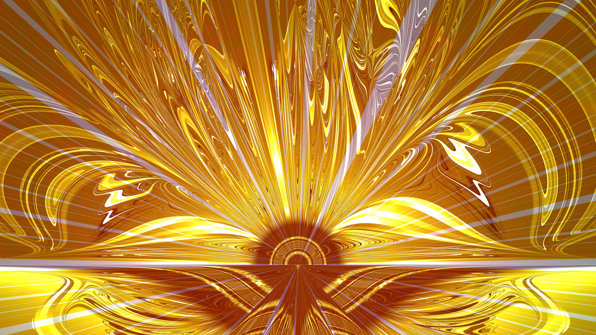
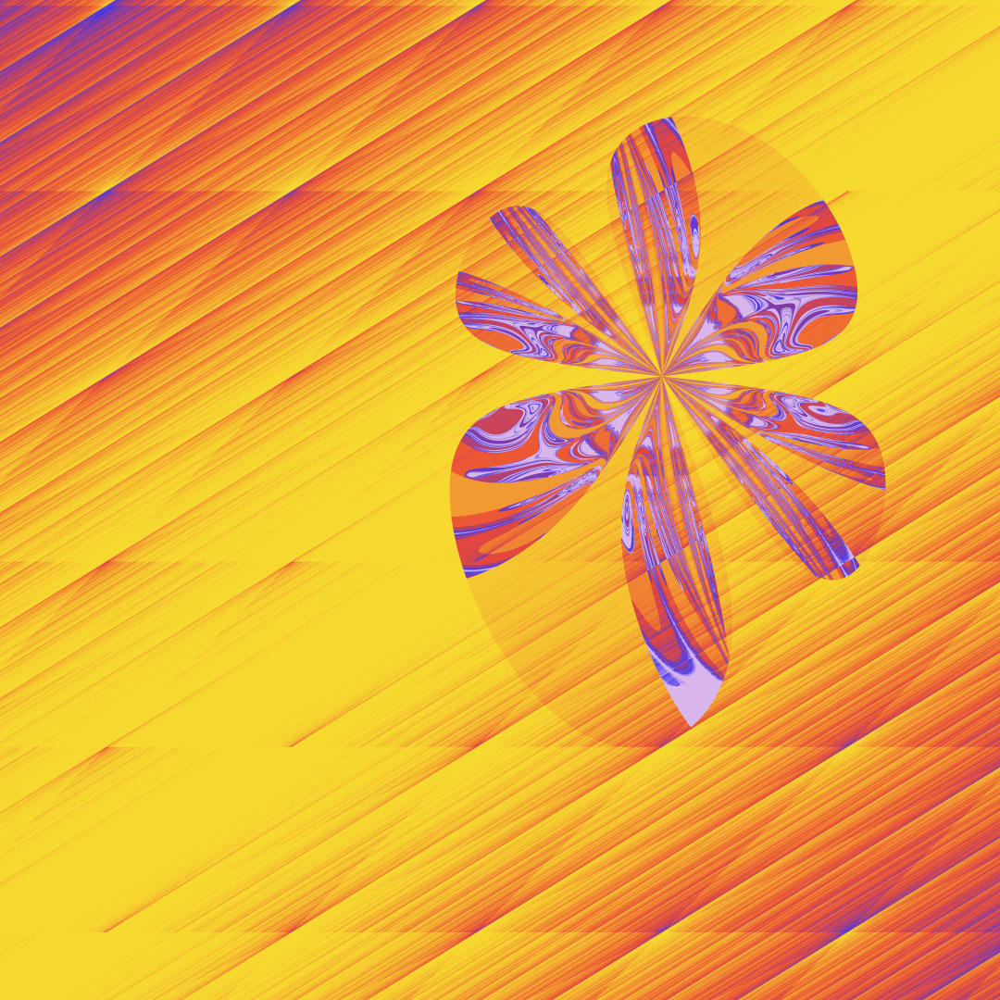
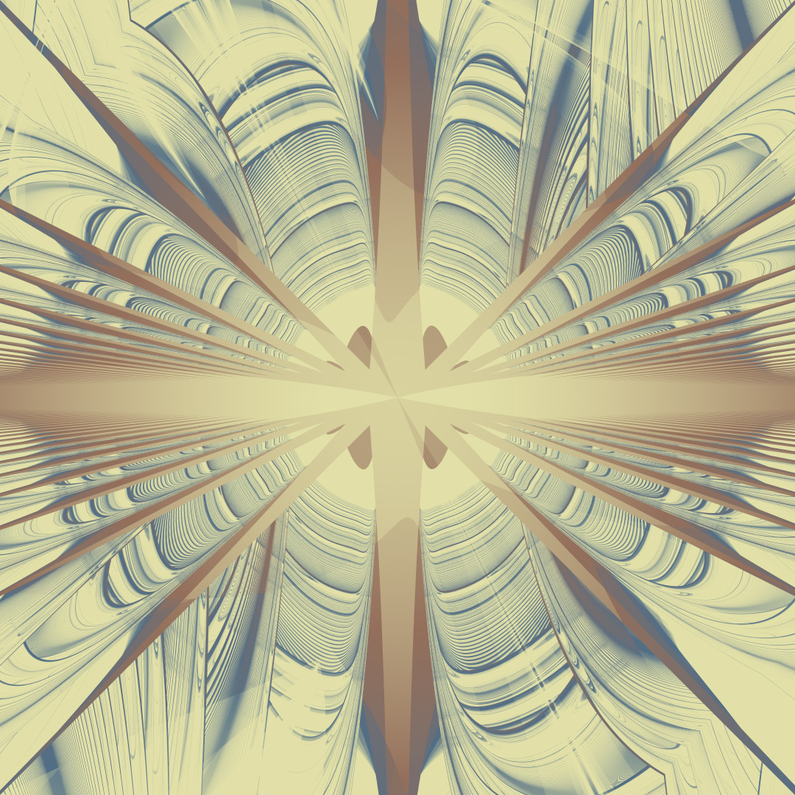
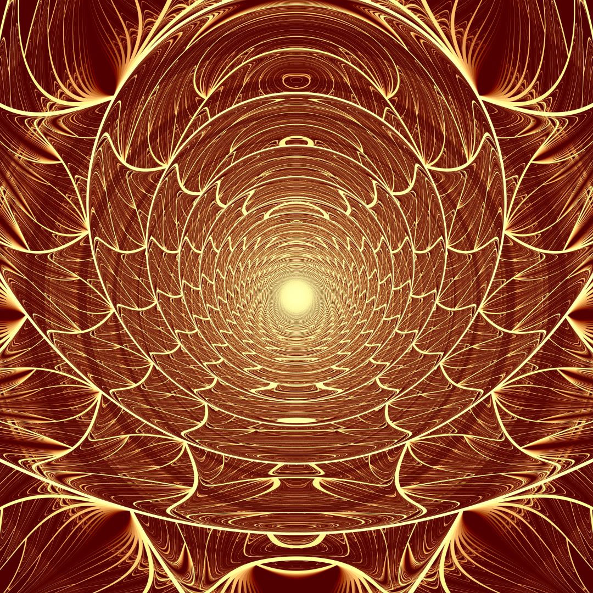
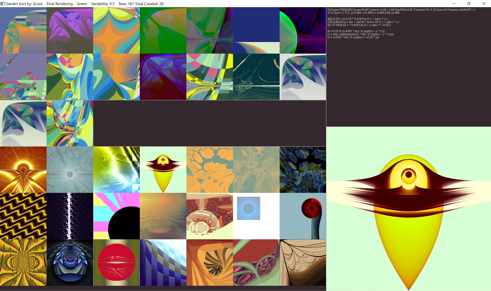
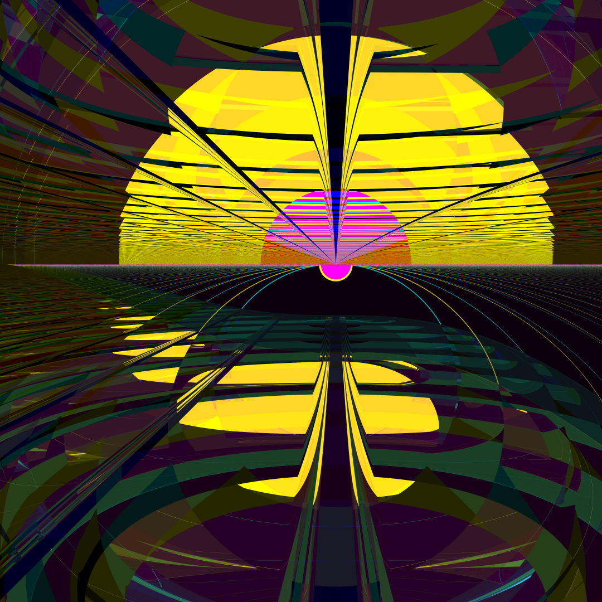
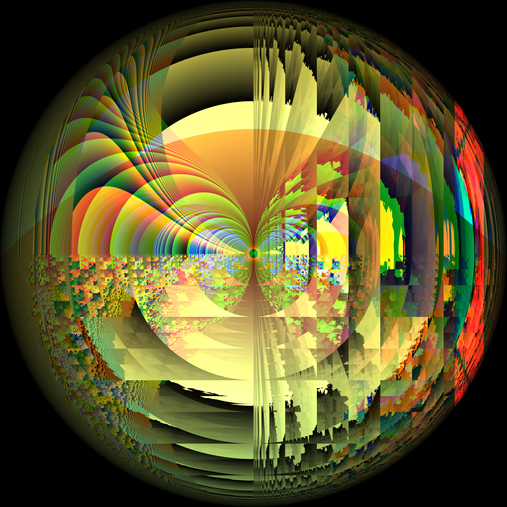
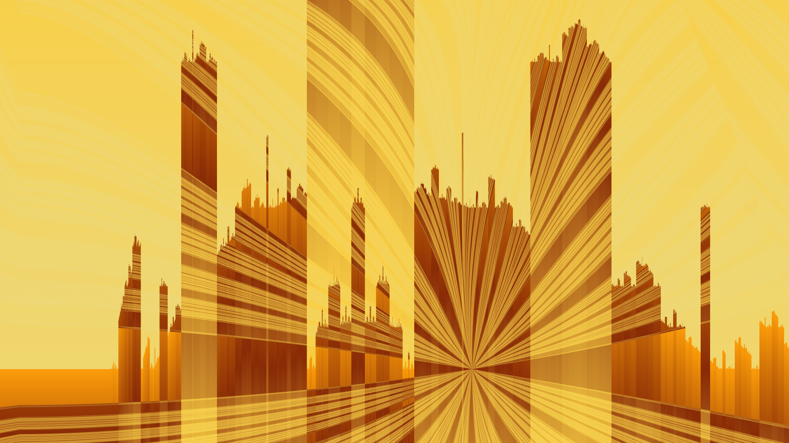

# Genetic Art

Written from 1998-2022 by David McAllister, [davemc0@gmail.com](mailto:davemc0@gmail.com)

Genetic art is a form of generative art (code-based computer art) that involves these main elements:

1) A description of the artistic result as code, equations, coordinates, etc., like DNA
2) A renderer that turns the encoding into the actual art, like how birth and growth turn DNA into living things
3) A way of choosing which art objects are most fit to become the parents of new ones
4) Methods of crossover and mutation that take the DNA-like encoding of the parents and make a similar encoding of a new child
5) Repeatition of these steps causes the resulting art to keep getting more and more pleasing

In my program, you or I, the artist, perform step 3 by selecting which pictures we like and having the program change and breed them to make children.

Genetic art is represented as a set of one or three equations that compute the color of each pixel in the image based on its x,y coordinates. The concept of inserting the artist at step 3 was introduced by Karl Sims in his 1995 Siggraph paper and he proposed basically the whole genetic art process. 

What sets this program apart is that it makes great organic images, far better than Karl Sims' original or any that I've seen that closely follow his idea. My program gives great fractal results, but it's not a fractal renderer like typical ones.

This program is implemented in C++, CUDA, and OpenGL. I originally developed it on Linux, but I've only run it on Windows lately. I hope it will build on Linux or Mac straightforwardly.

Building the Program
====================

GenArt depends on DMcTools: https://github.com/davemc0/DMcTools.git. DMcTools is my collection of graphics tools - matrix class, image stuff, 3D vector class, random numbers, timer, 3D model loader, etc. You'll need to download it, but not build it.

You will also need:

* CUDA 11.6 (You could try an older one, but no guarantees.)
* CMake 3.20 or newer. (You could try an older one, but no guarantees.)
* FreeGLUT. I use 3.2.2.
* GLEW. I use 2.2.0.

I set environment variables for GLUT_HOME and GLEW_HOME on Windows. This shouldn't be necessary on Linux or Mac.

How to build
------------

In the main directory, do something like:

    git clone https://github.com/davemc0/GenArt.git
    git clone https://github.com/davemc0/DMcTools.git
	cd GenArt
    mkdir build
	cd build
	cmake .. -G "Visual Studio 16 2019" -A x64
	cd ..

Then you can build from the command line:

    cmake --build build/ --config Release

or launch build/ParticleSolution.sln in Visual Studio.

Please let me know if you have trouble building. I would be happy to try to help.

# The rest of this README is a little out of date.

Starting the Program
====================

The program only runs on CUDA-capable Nvidia GPUs.

The file format for storing the equations that make the pictures is .gnx. It’s actually a text file. Each genetic individual is four lines long. You can start the program either by itself or by dragging one or more .gnx files onto the program’s icon. The program will take several seconds to load the file and will then draw the main program window and start drawing the individuals.

If you start the program by opening a file, say _filename.gnx_, it will save back to that same file. It first makes a copy of the original file called _filename_\_old.gnx. Each time it saves, it keeps the previous copy around as _filename_\_bkp.gnx. Everything is autosaved once every four times you press the space bar.

Using the Program
=================

The program has two windows. The black DOS window prints stuff out. The main window is divided into three subwindows. From top to bottom they are the Child Window, the Parent Window, and the Zoo.

The Zoo
-------

The zoo is on the bottom. It shows every individual that currently exists, including those also shown in the Parent or Child windows. You may have several hundred individuals in your zoo. You can scroll through them using the _UP/DOWN_ keys or the _PAGE UP/PAGE DOWN_ keys.

Left click an individual to select it as a parent.

The Parent Window
-----------------

This is the one-row-high window in the middle. Click on individuals to put them here and let them be chosen as parents of new individuals. To remove a parent and send it back to the zoo, just left click on it.

When a new child is to be created, one or two parents for it are randomly chosen from the parent window based on their scores. For example, an individual with a score of 0.8 will be twice as likely to be chosen as an individual with a score of 0.4. Once the parents have been randomly chosen the child is created via mutation and cross-over. Portions of one individual are discarded and portions of the other are spliced in their place. This is done to the three equations and to the palette. Mutation is done by discarding part of an equation and putting a new random equation in the empty spot. The new child will have a score of 0.01.

If nothing is in the parent window, the new children will be created randomly. Many of these first generation ones look very boring. About one out of five new children are created randomly, even if there are parents available. This is supposed to increase the amount of variety.

The Child Window
----------------

This window is at the top. It contains the new individuals that have not been scored by you yet. You can tweak these as described below, or delete particularly ugly ones by middle-clicking them. But usually you choose the few that you like, then press _SPACE_ to delete all the rest and make new ones.

With the ones you like, press ‘1’ through ‘9’ to give them a score of 0.1 through 0.9. This will also move them out of the Child window into the main zoo. Left-clicking on them will give them a score of 0.5 and move them into the parent window.

The Title Bar
-------------

The window title contains lots of information. If it starts with “AA” it means it’s doing some background rendering. If you press ‘A’ it will turn that off for a little while.

The first number is the index number of where in the zoo the selected individual is. 0 is at the top.

The next number is the individual’s unique ID number.

Then comes the score, something like “0.4”. Next, the “AA=1” means that this one hasn’t been smoothed yet. When it has, it will say “AA=7”. If you press ‘j’ on the individual, then it will be re-rendered with 30 more samples per pixel and say “AA=31”. Smoothing, or anti-aliasing, makes the pictures look less jaggy and grainy by doing more computation to create the image.

It then tells you the kind of image this is (RGB/YCrCb/ColorMap).

Next is the Generation. Images made from scratch are generation 1. Their children are generation 2 and so on. The child of two images with generations 5 and 12 will be 13. If a really nice image says generation 1, it’s been around since before I started keeping track of lineage.

The next numbers are the unique ID numbers of the parents. If one of the numbers is -1, it means that it was a mutation of only one parent. If both numbers are the same, it means it was a cross-over of that parent with itself. If both numbers are -1 it means this individual has been around since before I started keeping track of lineage.

Finally, the title tells how things are sorted - by score, ID number, or generation.

Operations
==========

Generic Commands
----------------

Many operations that don’t apply to a specific individual work in all three windows:

_Right Click_       Get a menu and a reminder of what keystroke does each thing

_Space Bar_         Delete everything in the Child window and create new children. This also re-sorts everything. It also saves everything once every four times.

_‘e’_               Save all individuals to the .gnx file

_‘t’_               Sort all individuals. This cycles between three ways of sorting:

·         by score (biggest at the top)

·         by unique individual number (oldest at the top)

·         by generation number (earliest at the top)

_‘A’_               Toggle background rendering on/off. When on (the default) the program will first compute the image of every individual, even those not visible on the screen. Then it will recompute them all with antialiasing (smoothing) enabled. High quality antialiasing using ‘j’ is also done in the background.

_‘F’_               Reset scores of every individual to 0.01

_‘R’_               Measure how many different colors are in each individual and assign scores based on colorfulness. This isn’t very useful.

_‘q’_ or _ESCAPE_     Quit the program (You should press ‘e’ to save first.)

Operations on Individuals
-------------------------

The following operations work in any window. They apply to the individual the mouse is hovering on when the key or menu item is selected.

_Middle Button_     Delete this individual permanently

_‘0’, ‘d’_ or _DEL_   Delete this individual permanently

_‘1’ - ‘9’_         Give this individual a score of 0.1 through 0.9

_‘p’_               Print the equations and other info for this individual to the text window

_‘D’_               Delete all individuals in the zoo from the current one and lower. Be careful with this.

_‘s’_               Save an image of this individual to disk. **See note below.** This may take a while. The filename will be G000xxxx.jpg, where the xxxx is the individual’s unique ID number.  

_‘o’_               Save this and all images after it in the zoo. **See note below.** This will take ALL NIGHT if you have lots of images. See the DOS window for progress.

_‘<’ ‘>’_           Decrease or increase this individual’s score

_Note: The rendering resolution of saved images is 512x512 by default. Specifying “-size <wid> <hgt>” on the command line changes this. (In the free version of the program, it cannot be set above 512x512. Mail [davemc0@gmail.com](mailto:davemc0@gmail.com) to get the full version.)_

Tweaking Individuals
--------------------

There are operations that tweak the appearance of an individual. These operations apply to the individual the mouse is hovering on when the key or menu item is selected. The pictures can be represented in one of three basic ways. They can be an RGB (red/green/blue) image, a YCrCb image (where the three values represent the brightness and chrominance), or a ColorMap image where the red channel tells which color from the palette to use at each pixel. Some images also use another variable, t. If the individual uses t, you can change t to slightly vary the shape of the image.

_‘r’_               Copy the red channel into the other two

_‘g’_               Copy the green channel into the other two

_‘b’_               Copy the blue channel into the other two

_‘x’_               Replace a random section of the palette with a random color

_‘X’_               Replace the whole palette with random colors

_‘c’_               Cycle between RGB, YCrCb, and ColorMap styles

_‘C’_               Replace all the random constants in the equations with slightly different ones (tweaks the shape of the image)

_‘j’_               Smooth the thumbnail image a lot

_LEFT/RIGHT_        Increase or decrease the _t_ value (tweaks the shape of the image). This doesn’t always make a difference.

_Note: When tweaking, it is a good idea to make the individual a parent, create a bunch of children, and tweak a child that looks like the one you’re interested in. This will prevent you destroying the ones you love._

An example of tweaking is to press _‘c’_ to view the image in all three color modes. In RGB mode, if you can tell that only one of the channels is doing anything interesting, press _‘r’, ‘g’, or ‘b’_ to make a gray scale image based on that channel. Then press _‘c’_ to switch to palette mode. Press _‘X’_ until it creates a palette you kind of like. Then press ‘x’ and hopefully it will make the palette even better. Press _‘C’_ or the left/right arrows to tweak the shape a little bit.

